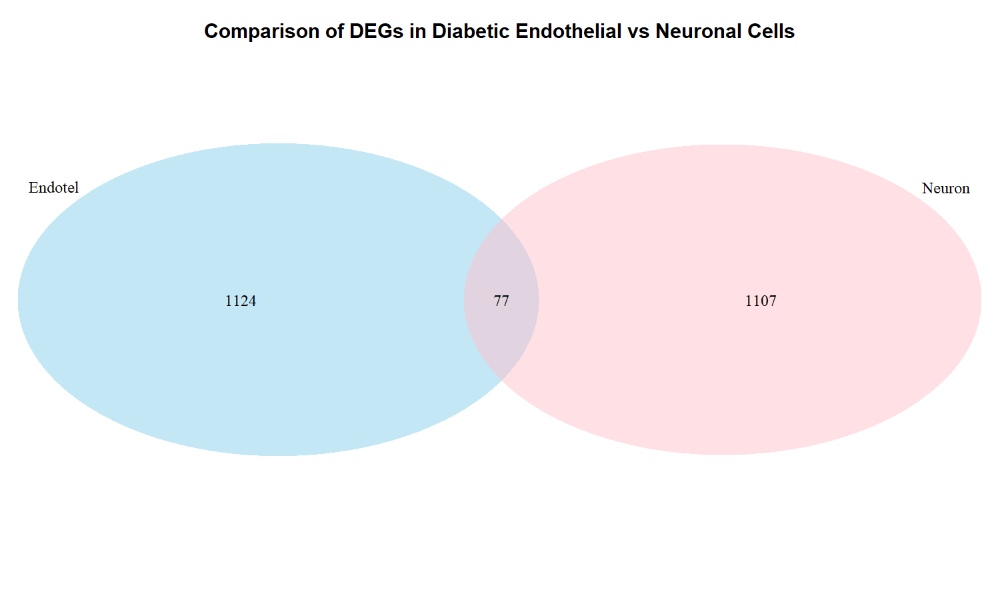
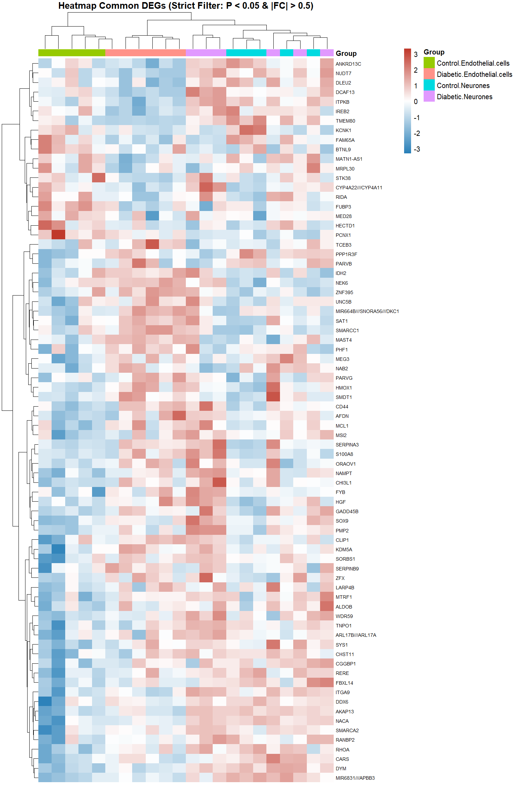
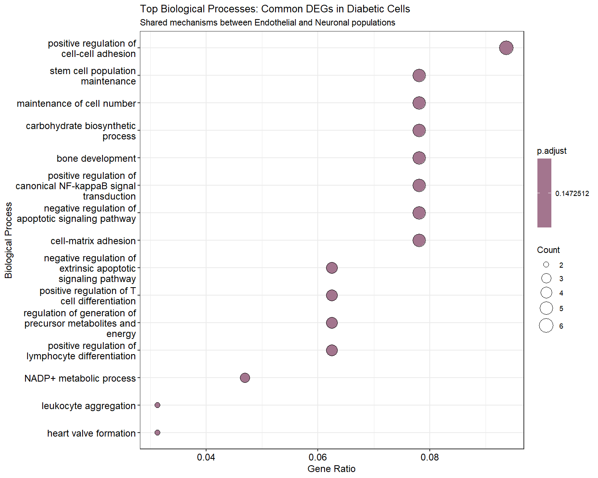
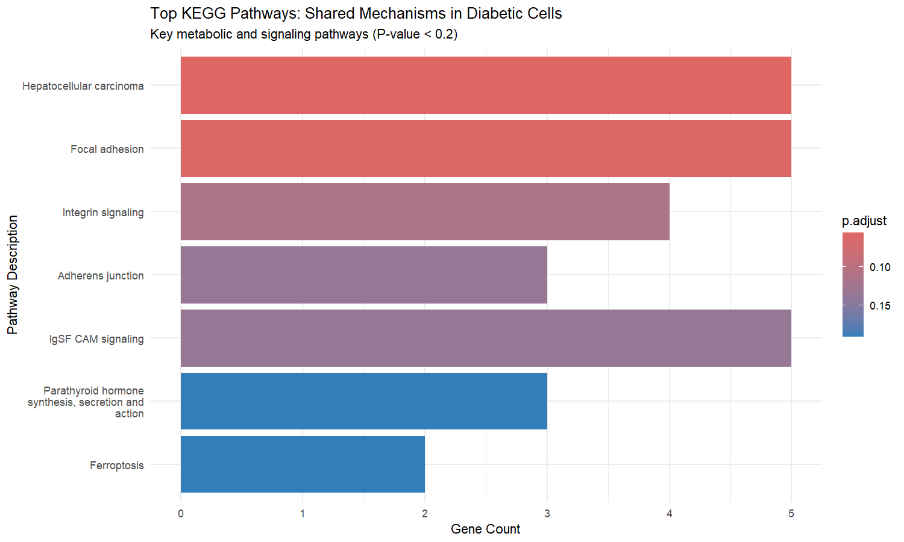
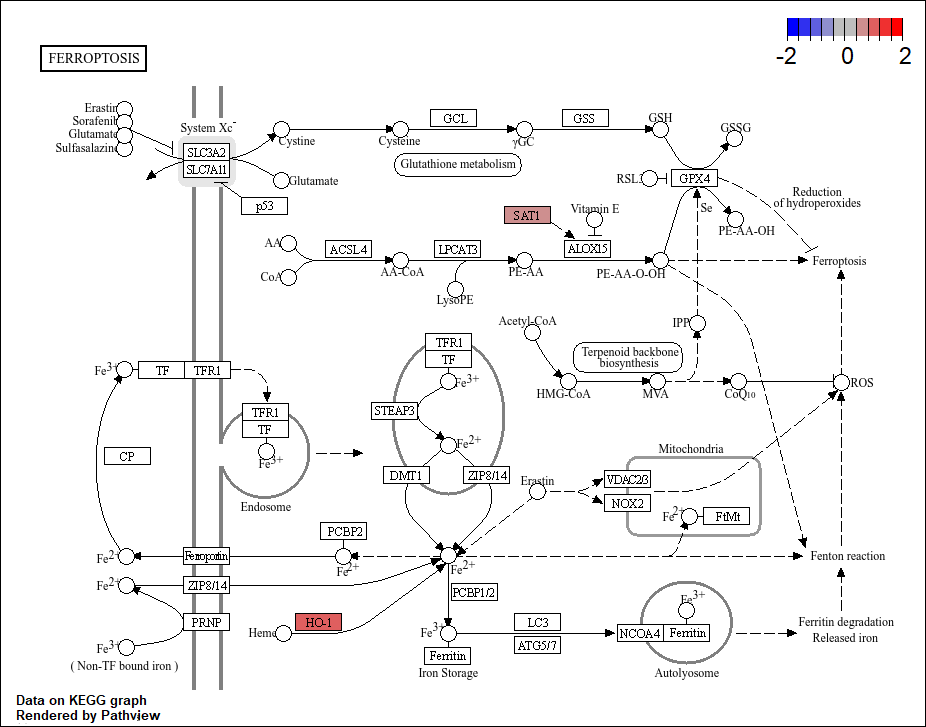
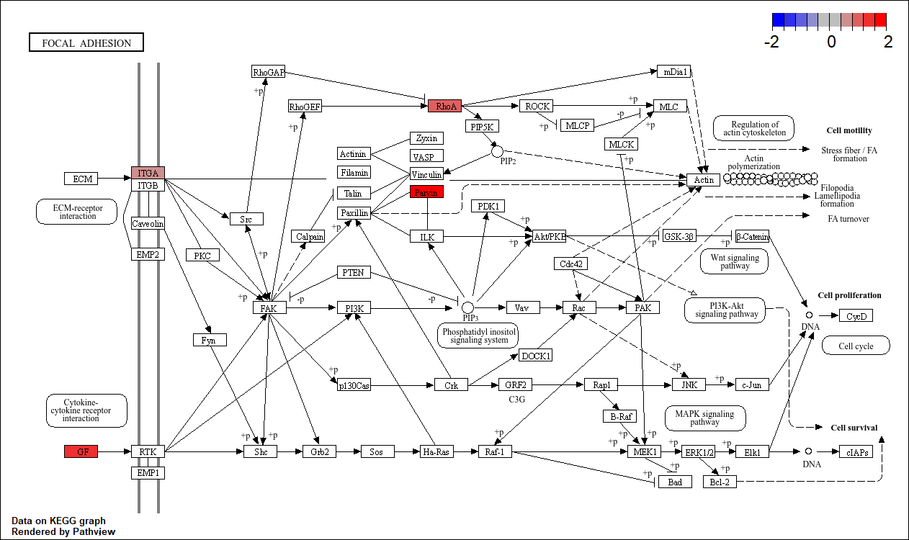
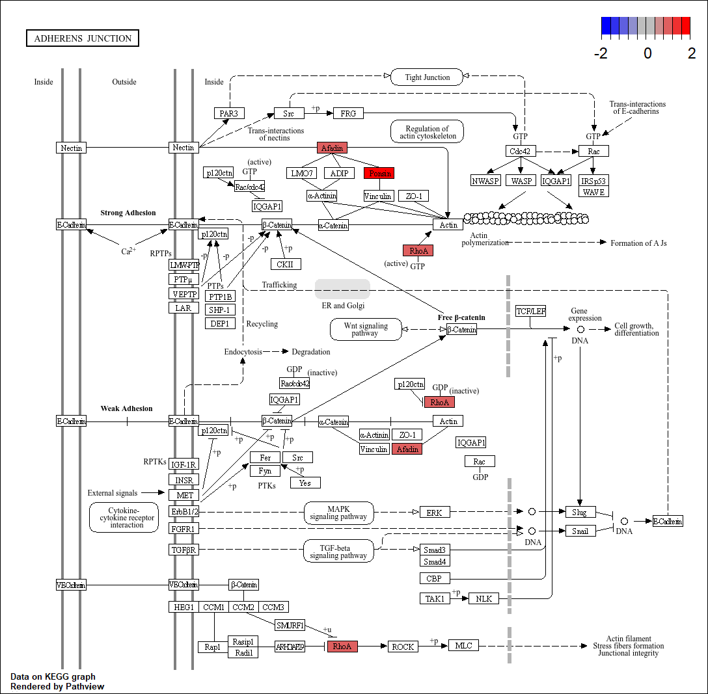
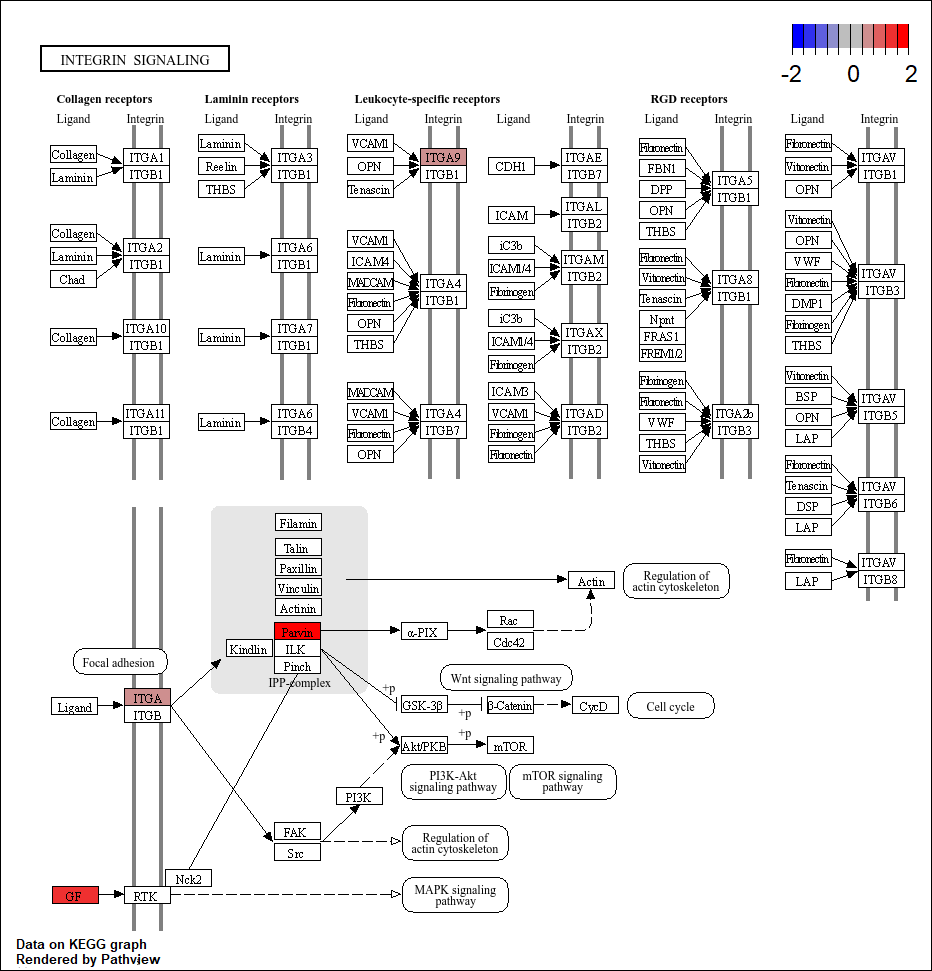

# Profil Ekspresi Gen Unit Neurovaskular pada Diabetes Melitus Tipe 2


# 1. Pendahuluan
Diabetes Melitus Tipe 2 (T2DM) merupakan faktor risiko utama bagi penyakit neurodegeneratif, termasuk demensia dan Alzheimer. Kerusakan ini diduga berakar pada resistensi insulin perifer yang memicu kegagalan pada unit neurovaskular otak. Proyek ini bertujuan untuk memetakan perubahan ekspresi gen secara sinkron pada sel neuron kortikal dan sel endotel untuk mengidentifikasi mekanisme kerusakan bersama (common pathways) akibat paparan hiperglikemia kronis.

# 2. Metode
Analisis ini menggunakan dataset publik GSE161355 yang diperoleh dari database NCBI _Gene Expression Omnibus_ (GEO), menggunakan platform _Microarray Affymetrix Human Genome U133 Plus 2.0 Array_.

Analisis dilakukan secara sistematis menggunakan bahasa pemrograman R dengan tahapan utama:
### 2.1. _Preprocessing data_ 
Normalisasi data microarray dan transformasi Log2.

```R
# Data Acquisition and Normalization
gset <- getGEO("GSE161355", GSEMatrix = TRUE)[[1]]
ex <- exprs(gset)
ex[ex <= 0] <- NA
ex <- log2(ex) # Log2 transformation for normal distribution
```

### 2.2. Filtering Sampel Berdasarkan Tipe Sel
Dataset GSE161355 mengandung berbagai tipe sel (Endotel, Neuron, dan Astrosit). Pemfilteran dilakukan untuk mengisolasi populasi sel endotel dan neuron agar perbandingan Diabetic vs Control akurat.

```R
# Memilih kelompok spesifik (fokus pada Endotel dan Neuron)
grup_fokus <- c(
    "Control.Endothelial.cells", 
    "Diabetic.Endothelial.cells", 
    "Control.Neurones", 
    "Diabetic.Neurones"
)

# Filter ExpressionSet dan reset level faktor
gset_filtered <- gset[, gset$group %in% grup_fokus]
gset_filtered$group <- factor(gset_filtered$group, levels = grup_fokus)
```

### 2.3. _Differential Expression Analysis_ (`limma`)
Identifikasi DEG menggunakan model linier (`limma`). Mengingat jumlah sampel yang terbatas (n=6), ambang batas signifikansi ditetapkan pada Raw P-Value < 0.05 untuk meminimalkan risiko false negatives dalam eksplorasi jalur biologis.

```R
# Statistical Modeling with limma
design <- model.matrix(~0 + gset_filtered$group)
fit <- lmFit(gset_filtered, design)
contrast_matrix <- makeContrasts(
    Diabetes_Efek_Endotel = Diabetic.Endothelial.cells - Control.Endothelial.cells,
    Diabetes_Efek_Neuron = Diabetic.Neurones - Control.Neurones,
    levels = design
)
fit2 <- eBayes(contrasts.fit(fit, contrast_matrix))

# Mengambil hasil akhir untuk masing-masing tipe sel
res_endotel <- topTable(fit2, coef="Diabetes_Efek_Endotel", adjust="fdr", number=Inf)
res_neuron <- topTable(fit2, coef="Diabetes_Efek_Neuron", adjust="fdr", number=Inf)

# Filter menggunakan Raw P-Value < 0.05 (Threshold Eksploratif)
res_endotel_sig <- res_endotel[res_endotel$P.Value < 0.05, ]
res_neuron_sig <- res_neuron[res_neuron$P.Value < 0.05, ]
```

### 2.4. _Genes Annotation_
Pemetaan Probe ID ke Gene Symbol menggunakan database hgu133plus2.db (Affymetrix Human Genome U133 Plus 2.0 Array) untuk interpretasi data yang lebih mudah.

```R
# Gene Mapping and Annotation
gene_ann <- AnnotationDbi::select(
    hgu133plus2.db, 
    keys = probe_ids, 
    columns = c("SYMBOL", "GENENAME"), 
    keytype = "PROBEID"
)
```

### 2.5 _Data Visualization (Volcano Plot, Venn Diagram, & Heatmap)_
Visualisasi dilakukan untuk memvalidasi distribusi gen dan melihat pola pengelompokan sampel secara global maupun spesifik.

***1. Volcano Plot***
```R
# Volcano Plot: Endotel (Threshold: P < 0.05 & |logFC| > 0.5)
res_endotel$status <- "NO"
res_endotel$status[res_endotel$logFC > 0.5 & res_endotel$P.Value < 0.05] <- "UP"
res_endotel$status[res_endotel$logFC < -0.5 & res_endotel$P.Value < 0.05] <- "DOWN"
ggplot(res_endotel, aes(x = logFC, y = -log10(P.Value), color = status)) +
  geom_point(alpha = 0.4, size = 1.5) +
  scale_color_manual(values = c("DOWN" = "blue", "NO" = "grey", "UP" = "red")) +
  theme_minimal() + labs(title = "Volcano Plot: Endothelial Cells"
)

# Volcano Plot: Neuron (Threshold: P < 0.05 & |logFC| > 0.5)
res_neuron$status <- "NO"
res_neuron$status[res_neuron$logFC > 0.5 & res_neuron$P.Value < 0.05] <- "UP"
res_neuron$status[res_neuron$logFC < -0.5 & res_neuron$P.Value < 0.05] <- "DOWN"
ggplot(res_neuron, aes(x = logFC, y = -log10(P.Value), color = status)) +
  geom_point(alpha = 0.4, size = 1.5) +
  scale_color_manual(values = c("DOWN" = "blue", "NO" = "grey", "UP" = "red")) +
  theme_minimal() + labs(title = "Volcano Plot: Neuronal Cells"
)
```
***2. Venn Diagram***
```R
# Venn Diagram: Membandingkan irisan DEGs antar tipe sel
draw.pairwise.venn(
  area1 = nrow(res_endotel_sig),
  area2 = nrow(res_neuron_sig),
  cross.area = length(common_genes),
  category = c("Endotel", "Neuron"),
  fill = c("skyblue", "pink")
)
```
***3. Heatmap***
```R
# Heatmap untuk Common DEGs
common_genes <- intersect(
  res_endotel$Gene.symbol[res_endotel$P.Value < 0.05 & abs(res_endotel$logFC) > 0.5],
  res_neuron$Gene.symbol[res_neuron$P.Value < 0.05 & abs(res_neuron$logFC) > 0.5]
)

# Matriks ekspresi
common_genes <- common_genes[common_genes != "" & !is.na(common_genes)]
mat_heatmap <- ex_filtered[rownames(res_endotel[res_endotel$Gene.symbol %in% common_genes, ]), ]
rownames(mat_heatmap) <- res_endotel$Gene.symbol[res_endotel$Gene.symbol %in% common_genes]
mat_heatmap <- mat_heatmap[!duplicated(rownames(mat_heatmap)), ] # Unique Gene Representation

# Visualisasi heatmap
pheatmap(
  mat_heatmap, 
  scale = "row", 
  clustering_method = "ward.D2", 
  annotation_col = data.frame(Group = gset_filtered$group),
  color = colorRampPalette(c("blue", "white", "red"))(100)
)
```

### 2.6. _Enrichment Analysis_ 
Identifikasi gen yang beririsan (common DEGs) antara kedua tipe sel menggunakan database _Gene Ontology_ (GO) dan _Kyoto Encyclopedia of Genes and Genomes_ (KEGG) untuk memetakan perubahan jalur fungsional.

```R
# GO Enrichment (Biological Process)
go_bp <- enrichGO(gene = genes_entrez$ENTREZID, OrgDb = org.Hs.eg.db, ont = "BP")

# KEGG Pathway Mapping & Visualization
kegg <- enrichKEGG(gene = genes_entrez$ENTREZID, organism = 'hsa')
pathview(gene.data = kegg_logFC, pathway.id = "hsa04216", species = "hsa")
```

Skrip R lengkap yang digunakan untuk analisis ini (termasuk pemrosesan `limma`, visualisasi `ggplot2`, dan pengayaan `clusterProfiler`) tersedia di folder utama repositori ini (file `Coding GSE161355.R`)


# 3. Hasil dan Pembahasan
### 3.1. Identifikasi _Common DEGs_

Analisis integratif menggunakan diagram Venn berhasil mengidentifikasi 77 gen yang beririsan (_common DEGs_) yang signifikan secara simultan pada sel endotel dan sel neuron.



Gambar 1. Diagram Venn menunjukkan irisan gen yang signifikan di kedua jenis sel



Gambar 2. Heatmap 77 gen utama menunjukkan pemisahan sempurna antara klaster Normal dan klaster Diabetes

### 3.2. Analisis Jalur Fungsional (GO & KEGG)



Gambar 3. Analisis _Gene Ontology_ (GO) pada 77 common DEGs menunjukkan gangguan pada proses biologis krusial, terutama positive regulation of cell-cell adhesion dan cell-matrix adhesion.



Gambar 4. Analisis _Kyoto Encyclopedia of Genes and Genomes_ (KEGG) mengidentifikasi 7 jalur yang signifikan secara statistik (P.Val < 0.2).



Gambar 5. _Ferroptosis_ (hsa04216)



Gambar 6. _Focal Adhesion_ (hsa04510)



Gambar 7. _Adherens Junction_ (hsa04520)



Gambar 8. _Integrin signaling_ (hsa04518)

# 4. Kesimpulan
Kerusakan unit neurovaskular pada Diabetes Tipe 2 tidak terjadi secara parsial, melainkan melibatkan interaksi kompleks antara kegagalan vaskular dan degenerasi saraf secara sinkron. Temuan ini menekankan pentingnya strategi terapeutik masa depan yang menggabungkan perlindungan saraf (neuroprotection) sekaligus perbaikan vaskular (vascular repair).
