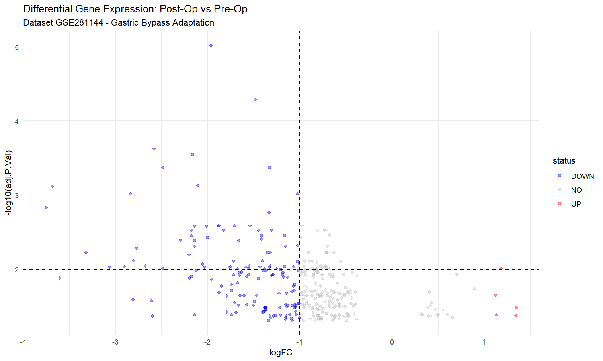
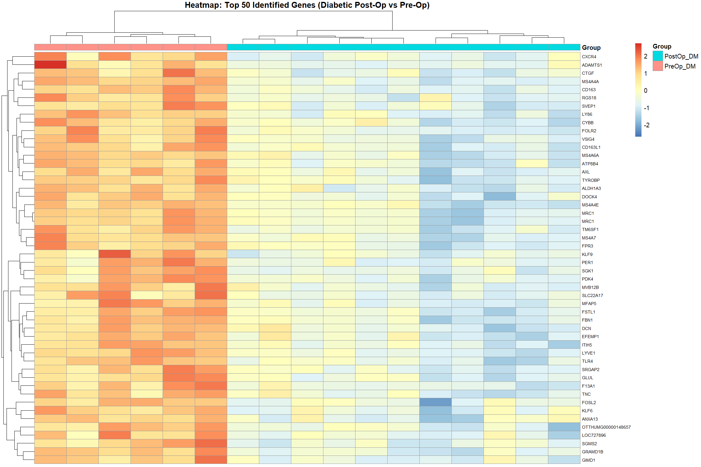
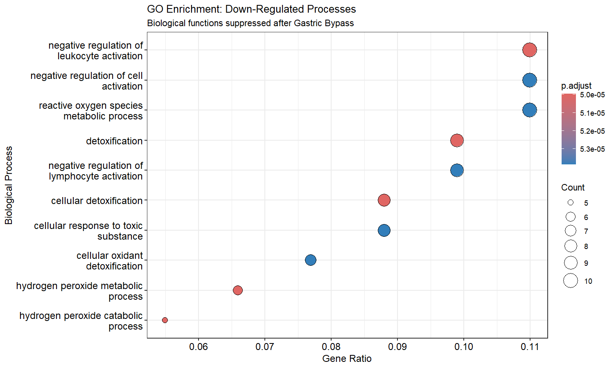
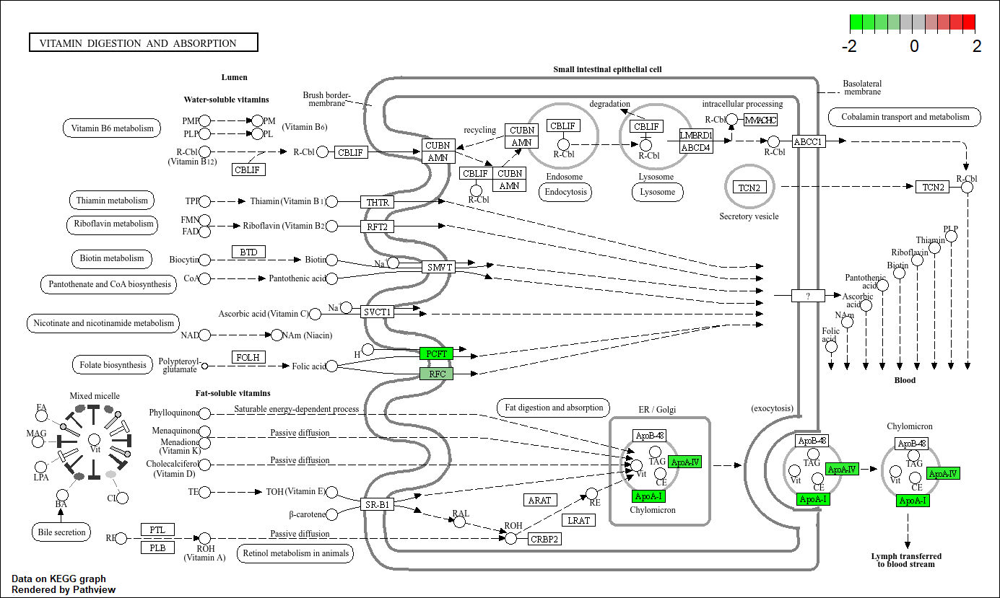

# Transcriptomic Analysis of Post-Roux-en-Y Gastric Bypass in Type 2 Diabetes Mellitus Patients

# 1. Introduction
Roux-en-Y Gastric Bypass (RYGB) surgery is recognized not only as an effective intervention for weight loss but also for its ability to induce glycemic remission in patients with Type 2 Diabetes Mellitus (T2DM). This project aims to identify Differentially Expressed Genes (DEGs) and characterize associated changes in metabolic and cellular signaling pathways following the procedure.

# 2. Methods
This analysis is based on the publicly available dataset GSE281144 from the NCBI Gene Expression Omnibus (GEO), generated using the Affymetrix Human Transcriptome Array 2.0 platform.

The analysis was performed systematically in R with the following main stages:
### 2.1. Data Preprocessing 
Microarray data normalization and Log2 transformation.

```R
# Data Acquisition and Normalization
gset <- getGEO("GSE281144", GSEMatrix = TRUE)[[1]]
ex <- exprs(gset)
ex[ex <= 0] <- NA 
ex <- log2(ex) # Log2 transformation for normal distribution
```

### 2.2. Differential Analysis
DEGs were identified using linear models (`limma`) with an Adjusted P-Value < 0.05 to compare the Post-Op group against the Pre-Op group.

```R
# Statistical Modeling with limma
design <- model.matrix(~0 + gset$group)
fit <- lmFit(ex, design)
contrast_matrix <- makeContrasts(PostOp_DM - PreOp_DM, levels = design)
fit2 <- contrasts.fit(fit, contrast_matrix)
fit2 <- eBayes(fit2) # Empirical Bayes moderation

# Get top significant genes (FDR < 0.05)
topTableResults <- topTable(fit2, adjust = "fdr", number = Inf, p.value = 0.05)
```

### 2.3. Gene Annotation
Probe IDs were mapped to gene symbols using annotation data provided by GEO.

```R
# Extract feature metadata (genes) from the gset object
feature_data <- fData(gset)
extracted_symbols <- sub("^[^//]* // ([^//]*) // .*$", "\\1", feature_data$gene_assignment)
extracted_names <- sub("^[^//]* // [^//]* // ([^//]*) // .*$", "\\1", feature_data$gene_assignment)

# Construct annotation map
anno_map <- data.frame(
  PROBEID = feature_data$ID,
  SYMBOL = extracted_symbols,
  GENENAME = extracted_names,
  stringsAsFactors = FALSE
)

# Merge annotation with statistical results
topTableResults <- merge(topTableResults, anno_map, by = "PROBEID", all.x = TRUE)
topTableResults$SYMBOL[topTableResults$SYMBOL == "---"] <- NA
topTableResults$GENENAME[topTableResults$GENENAME == "---"] <- NA
head(topTableResults[, c("PROBEID", "SYMBOL", "GENENAME")])
```

### 2.4. Data Visualization (Volcano Plot & Heatmap)
Visualization was performed to assess global gene expression distributions and to examine clustering patterns between clinical conditions (Pre-Op vs. Post-Op).

**1. Volcano Plot**
```R
# Data Preparation (Dataset GSE281144)
volcano_data <- data.frame(
  logFC = topTableResults$logFC,
  adj.P.Val = topTableResults$adj.P.Val,
  Gene = topTableResults$SYMBOL
)

# Classify gene expression status (Threshold: |logFC| > 1 & adj.P.Val < 0.05)
volcano_data$status <- "NO"
volcano_data$status[volcano_data$logFC > 1 & volcano_data$adj.P.Val < 0.05] <- "UP"
volcano_data$status[volcano_data$logFC < -1 & volcano_data$adj.P.Val < 0.05] <- "DOWN"

# Generate volcano plot
ggplot(volcano_data, aes(x = logFC, y = -log10(adj.P.Val), color = status)) +
  geom_point(alpha = 0.4) +
  scale_color_manual(values = c("DOWN" = "blue", "NO" = "grey", "UP" = "red")) +
  geom_vline(xintercept = c(-1, 1), linetype = "dashed") +
  geom_hline(yintercept = -log10(0.05), linetype = "dashed") +
  theme_minimal() +
  labs(title = "Differential Gene Expression: Post-Op vs. Pre-Op", 
       subtitle = "Dataset GSE281144 - Gastric Bypass Adaptation")
```
**2. Heatmap (Top 50 DEGs)**
```R
# Select top 50 DEGs
topTableAnnotated <- subset(topTableResults, !is.na(SYMBOL) & SYMBOL != "" & SYMBOL != "---")
topTableAnnotated <- topTableAnnotated[order(topTableAnnotated$adj.P.Val), ]
top50 <- head(topTableAnnotated, 50)

# Construct expression matrix
mat_heatmap <- ex[top50$PROBEID, ]
rownames(mat_heatmap) <- top50$SYMBOL

# Generate heatmap
pheatmap(
  mat_heatmap,
  scale = "row",                
  annotation_col = data.frame(Group = gset$group, row.names = colnames(mat_heatmap)),
  show_colnames = FALSE,       
  show_rownames = TRUE,
  fontsize_row = 7,
  clustering_method = "complete",
  main = "Heatmap: Top 50 Identified Genes (Diabetic Post-Op vs. Pre-Op)"
)
```

### 2.5. Enrichment Analysis 
Biological interpretation was performed using the Gene Ontology (GO) and Kyoto Encyclopedia of Genes and Genomes (KEGG) databases to identify enriched functional pathways.

```R
# GO Enrichment (Biological Process)
go_up <- enrichGO(gene = up_entrez$ENTREZID, OrgDb = org.Hs.eg.db, ont = "BP")
go_down <- enrichGO(gene = down_entrez$ENTREZID, OrgDb = org.Hs.eg.db, ont = "BP")

# KEGG Pathway Mapping and Visualization
kegg_enrich <- enrichKEGG(gene = all_entrez_df$ENTREZID, organism = 'hsa')
pathview(gene.data = kegg_logFC, pathway.id = "hsa04151", species = "hsa")
```

The full R script used in this analysis is available in the main directory of this repository (file `Coding GSE281144.R`)

# 3. Results and Discussion
### 3.1. Gene Expression Visualization (DEG)

The analysis revealed distinct transcriptomic differences between Pre-Op and Post-Op samples, with clear clustering patterns across conditions.



Figure 1. Volcano plot displaying DEGs based on significance (FDR < 0.05), with red (up-regulated) and blue (down-regulated) dots.



Figure 2. Heatmap of the top 50 DEGs showing distinct expression patterns with clear separation between Pre-Op and Post-Op groups.

### 3.2. Functional and Pathway Analysis (GO & KEGG)




Figure 3. Gene Ontology (GO) analysis suggests that the DEGs are involved in immune-related processes and metabolic regulation.


Figure 4. KEGG analysis identified 18 statistically significant pathways (adj.P.Val < 0.05).

Among these, three key pathways explain the clinical improvement in T2DM patients:
1. Gluconeogenesis Modulation (PI3K-Akt signaling)


Figure 5. PI3K-Akt signaling (hsa04151): Downregulation of PEPCK may reflect decreased gluconeogenic signaling in the liver.

2. Lipid Metabolism Reprogramming (PPAR signaling)


Figure 6. PPAR signaling (hsa03320): Downregulation of Apo-AI, PLTP, and Perilipin suggests changes in lipid transport and metabolic regulation.

3. Nutrient Absorption Adaptation (Vitamin digestion and absorption)



Figure 7. Vitamin digestion and absorption (hsa04977): Downregulation of PCFT and RFC may indicate altered folate absorption-related processes after gastric bypass surgery.

# 4. Conclusion
RYGB-induced transcriptomic changes suggest involvement of multiple pathways, including immune processes, gluconeogenesis, and nutrient transport. These findings emphasize the importance of post-operative nutritional monitoring.
